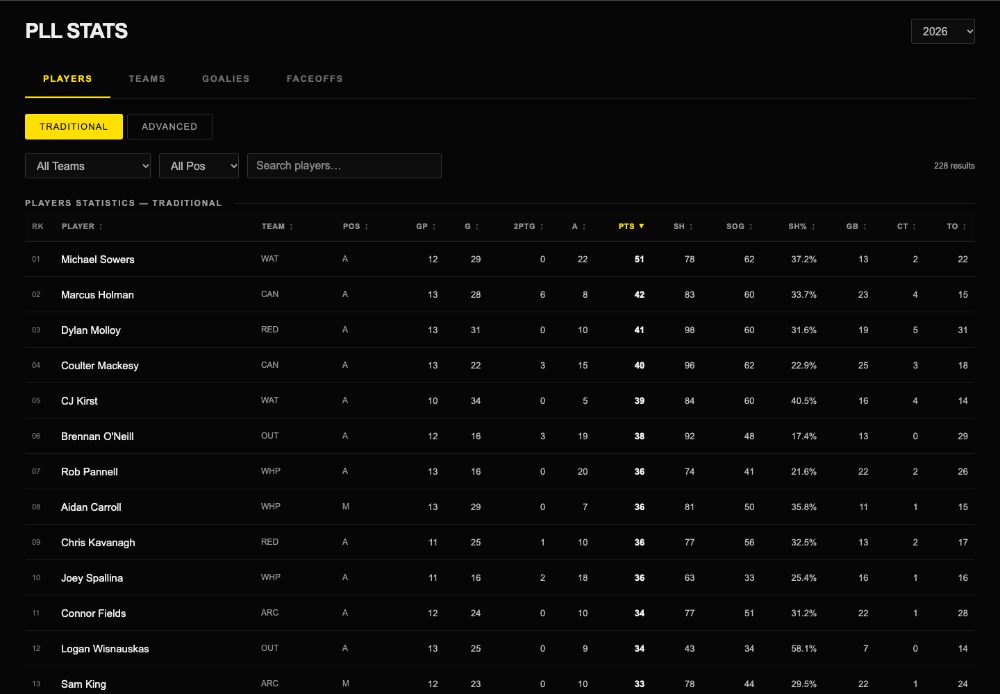

# PLL Analytics

[](https://github.com/UrBoiMasala/pll-analytics/actions/workflows/quality.yml)

Possession-based lacrosse analytics built with **Python, DuckDB SQL, and a lightweight web interface**.

Explore **35 core metrics across 2022–2026**: team efficiency and pace, player shooting,
two-point production, faceoffs, goalkeeping, and descriptive defensive statistics.
The pipeline preserves source records and exposes uncertainty instead of hiding it.

[Get started](docs/GETTING_STARTED.md) · [Documentation](docs/README.md) ·
[Metric catalog](docs/FINAL_METRIC_CATALOG.md) · [SQL examples](sql/publication_examples.sql)



*Local interface using the included partial-2026 snapshot.*

## What it does

- Reconstructs possessions from event feeds and checks scoring against official records.
- Computes team and player statistics in SQL, with explicit numerators and denominators.
- Exports analysis-ready CSVs with coverage, source gaps, and missing values preserved.
- Provides searchable tables and player pages in a local browser interface.

**Coverage:** 2026 is a frozen partial-season snapshot. The latest included game starts
**August 30, 2026 at 00:30 UTC**. Default outputs include completed regular-season and
playoff games; All-Star and incomplete games are excluded.

## Run locally

The frontend builds from included data using Python's standard library:

```sh
python3 -B frontend/scripts/build.py
python3 -m http.server 4173 --bind 127.0.0.1 --directory frontend/dist
```

Open **http://127.0.0.1:4173/**. For analytics dependencies and validation, follow the
[setup guide](docs/GETTING_STARTED.md).

## How it works

```text
PLL source JSON → normalized events → possessions → SQL metrics → CSVs + local UI
```

| Directory | Purpose |
| --- | --- |
| [frontend/](frontend/README.md) | Local statistics browser |
| [data/](data/README.md) | Frozen inputs and published outputs |
| [scripts/](scripts/README.md) | Builders, validators, and research tools |
| [sql/](sql/README.md) | Metric definitions and analysis queries |
| [tests/](tests/) | Regression checks |
| [docs/](docs/README.md) | Setup, definitions, and limitations |
| [archive/](archive/README.md) | Compact audit checkpoint |

## Interpretation matters

Possession spans are measured from available events; they are not complete clock-control
measurements. Goalie and defensive statistics do not isolate individual skill. The project
does not publish a universal player-value or MVP score. See the
[metric limitations](docs/METRIC_LIMITATIONS.md) before comparing players or seasons.

Source statistics: [Premier Lacrosse League](https://premierlacrosseleague.com/).
Independent research, not affiliated with or endorsed by the PLL. The existing
[publication record](docs/PUBLICATION_SAFETY.md) documents owner-reported permission;
it does not grant others a general license to reuse PLL data.
