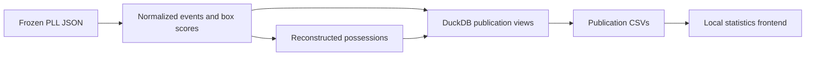

# Data pipeline

## Source and canonical layers

`data/raw/` preserves downloaded payloads and metadata. The ingestion and cleaning
scripts retain source anomalies and derive explicit eligibility flags. Canonical
per-season tables under `data/processed/` include games, events, possessions, and
player/team box scores.

`CANONICAL_MANIFEST_V1.json` describes the earlier checkpoint; v2 describes the
current foundation. Historical source hashes and version boundaries must not be
silently relabeled. The [audit archive](../archive/README.md) explains verification
without the original Git history.

## Publication layer

`scripts/pll_build_publication.py` loads frozen canonical inputs and executes
`sql/publication.sql`. It exports 13 tables under `data/publication/`, both pooled
and by season. Metric arithmetic lives in SQL. The builder does not fetch new games
or rerun older player-value research.

Keys include the season. Player IDs are strings so leading zeros survive. Actual-team
stints and season totals have distinct aggregation levels; names are labels, not keys.

## Presentation layer

`frontend/scripts/build.py` copies publication metrics and prepares traditional
box-score totals for the local interface. It writes only the ignored `frontend/dist/`
directory and records source hashes with the bundle. It does not alter canonical data.

## Historical rebuilds

The older `pll_refocus_foundation.py` transformation can rebuild the foundation but
still uses an original checkpoint commit for comparisons. It is not a first-run
command for a downloaded source archive. Use the [setup guide](GETTING_STARTED.md)
for the supported frozen-data workflow.
